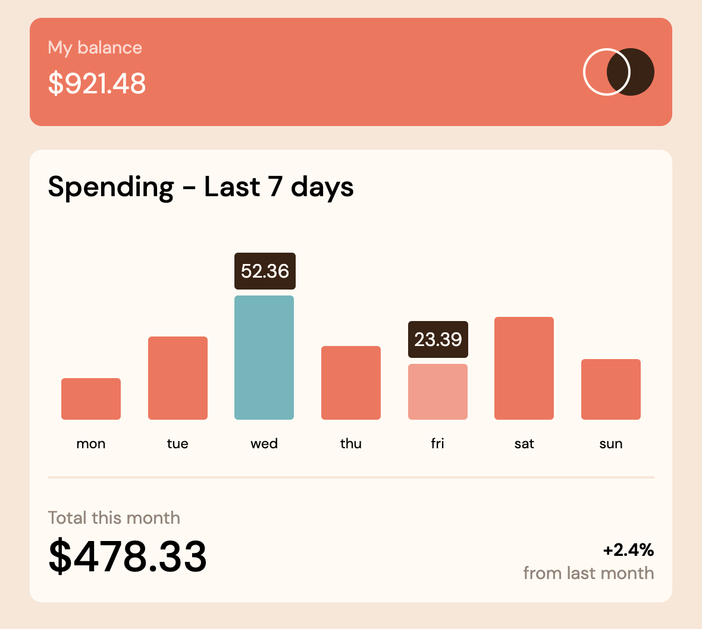

# Frontend Mentor - Expenses chart component solution

This is a solution to the [Expenses chart component challenge on Frontend Mentor](https://www.frontendmentor.io/challenges/expenses-chart-component-e7yJBUdjwt). Frontend Mentor challenges help you improve your coding skills by building realistic projects.

## Table of contents

- [Overview](#overview)
  - [The challenge](#the-challenge)
  - [Screenshot](#screenshot)
  - [Links](#links)
- [My process](#my-process)
  - [Built with](#built-with)
  - [What I learned](#what-i-learned)
  - [Continued development](#continued-development)
- [Author](#author)

## Overview

### The challenge

Users should be able to:

- View the bar chart and hover over the individual bars to see the correct amounts for each day
- See the current day’s bar highlighted in a different colour to the other bars
- View the optimal layout for the content depending on their device’s screen size
- See hover states for all interactive elements on the page
- **Bonus**: Use the JSON data file provided to dynamically size the bars on the chart

### Screenshot

### Links

- Solution URL @ [Github Repository](https://github.com/waffleflopper/expenses-chart-component)
- Live Site URL @ [Github Pages](https://waffleflopper.github.io/expenses-chart-component/)

## My process

### Built with

- Semantic HTML5 markup
- CSS custom properties
- Flexbox
- SASS
- Vanilla JS

### What I learned

Learned about using absolutely positioned elements within relative positioned elements to precisely position the outline circle versus the filled circle in the header.

Slowly attempting to get better at how I write out my CSS. I'm trying to avoid rewriting things in multiple spots when it can be accomplished with paying attention to inheritence or has a lot of overlap with another element. I'm going to go back through once I start a new project to have a set of fresh eyes to see where things can be improved.

### Continued development

Next up is getting started with either multi-page website challenges or more complex JS challenges. Multi-page will likely utilize SvelteKit or Next.JS.

## Author

- Website - [GitHub Pages](https://waffleflopper.github.io/)
- Frontend Mentor - [@waffleflopper](https://www.frontendmentor.io/profile/waffleflopper)
- Twitter - [@im_robertjames](https://www.twitter.com/im_robertjames)
